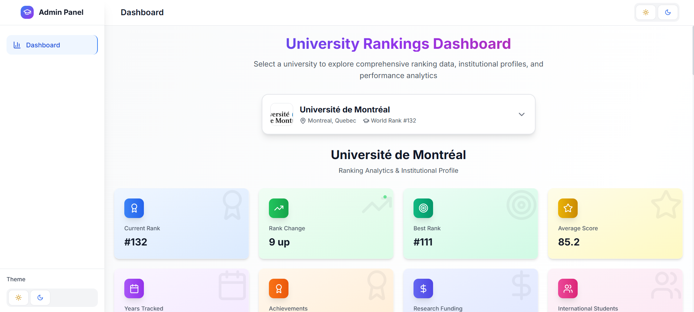
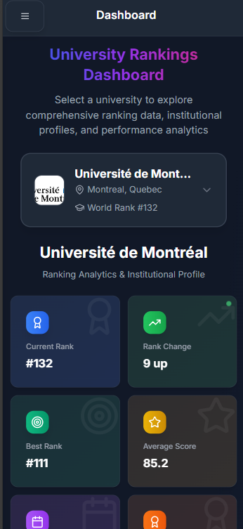
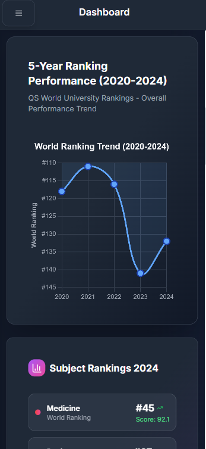

# University Dashboard 🎓

This project is a comprehensive University Dashboard. The dashboard provides an interactive and modern interface for exploring university rankings, institutional profiles, achievements, and key statistics. Built with Next.js, tRPC, and a modular component architecture, the application is designed for scalability, maintainability, and a seamless user experience across both desktop and mobile devices.

## Preview

<p align="center">
  
  
  
</p>

## About the Project

The University Dashboard enables users to:
- View and compare university rankings and performance trends
- Explore detailed university profiles, including achievements and key facts
- Access subject-specific rankings and institutional statistics
- Experience a responsive, user-friendly interface with light and dark modes

The project leverages type-safe APIs, modern React patterns, and a clean UI to deliver reliable and engaging data visualization for academic institutions.


## 📋 What's This About?

So I got tired of looking at boring university ranking tables and decided to build something more interactive. This dashboard shows:

- **Ranking trends** over 5 years (with pretty charts!)
- **Subject rankings** for different fields like Medicine, Engineering, etc.
- **University profiles** with all the juicy details
- **Achievements** and cool stuff each uni has done
- **Statistics** that actually make sense


*Planning to add more soon, but these are the main Canadian ones for now.*

## 🛠️ Tech Stuff I Used

- **Frontend**: Next.js 14 (the new App Router is pretty sweet)
- **Styling**: Tailwind CSS + Flowbite
- **Charts**: Chart.js 
- **API**: tRPC (type safety is life)
- **State**: TanStack Query 
- **Deployment**: Vercel 

## 🚀 Getting Started

### What You Need

Make sure you have:
- Node.js 18+ (I think 16+ might work too, but 18 is safer)
- npm or pnpm

### Let's Get This Running

1. **Clone it**
```bash
git clone https://github.com/sathiskumar30/UniversityAdminDashboard.git
cd UniversityAdminDashboard
```

2. **Install stuff**
```bash
npm install
# or if you're cool and use pnpm
pnpm install
```

> ⚠️ **Installation Issue?**
> 
> If you encounter errors while installing node modules, run:
> 
> ```bash
> npm install --legacy-peer-deps
> ```
> 
> This often resolves dependency conflicts during installation.

3. **Seed the database (Important!)**
```bash
# Run the seed script to populate the database with university data
npx tsx app/lib/seed.ts
```

This will create and populate the SQLite database with:
- University profiles and rankings
- Achievement data
- Statistics and performance metrics
- Subject rankings

*Note: The database file will be created at `database/university.db`*

4. **Start the dev server**
```bash
npm run dev
# or
pnpm dev
```

5. **Open your browser**
Go to [http://localhost:3000](http://localhost:3000) and you should see the magic!

### Environment Variables (Optional)

The project works fine without any env vars since we're using static data. But if you want to add real APIs later, create a `.env.local`:

## 📁 Project Structure

<pre>
university-dashboard-final/
├── app/                # Main Next.js app directory
│   ├── api/            # API routes (tRPC)
│   │   └── trpc/       # tRPC routers
│   │       └── [trpc]/ # Dynamic tRPC handlers
│   │           └── route.ts
│   ├── components/     # App-specific React components
│   ├── lib/            # Server-side utilities, DB, and logic
│   ├── providers/      # Context and theme providers
│   ├── globals.css     # App-wide styles
│   ├── layout.tsx      # Root layout
│   └── page.tsx        # Main dashboard page
├── components/
│   └── ui/             # Shared UI components (buttons, cards, etc.)
├── public/             # Static assets (images, icons)
├── styles/             # Global styles (if any)
├── database/           # SQLite database file
├── README.md           # Project documentation
├── package.json        # Project dependencies and scripts
└── next.config.js      # Next.js configuration
</pre>

## 🔧 Cool Features

### 1. **Type-Safe API (tRPC)**
- No more guessing what the API returns
- Automatic caching (React Query is the best)
- Optimistic updates (feels super responsive)
- Proper error handling (because stuff breaks)

### 2. **Interactive Charts**
- Line charts showing ranking trends
- Subject rankings with pretty colors
- Statistics cards that look good
- Works on mobile (kinda important these days)

### 3. **University Profiles**
- All the info you'd want to know
- History and fun facts
- Contact info and social media
- Achievement highlights

### 4. **Modern UI**
- Dark/light theme (because why not)
- Smooth animations (looks fancy)
- Loading states (users like feedback)
- Mobile responsive (obviously)


### Connecting to Real APIs

Right now it uses static data. To make it real:

1. Update the API routes in `app/api/`
2. Modify tRPC stuff in `app/api/trpc/route.ts`
3. Update the components to use real data


**Built with ❤️ and probably too much coffee**

If you like this, give it a ⭐ on GitHub! It makes my day 😊

*P.S. If you find any bugs, let me know. I'm still learning!*
